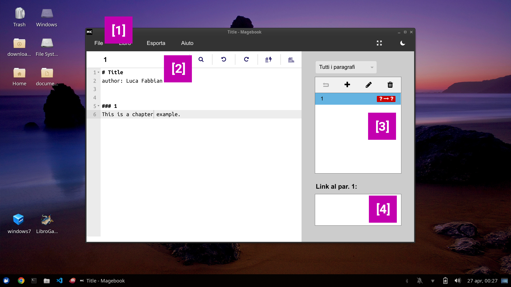
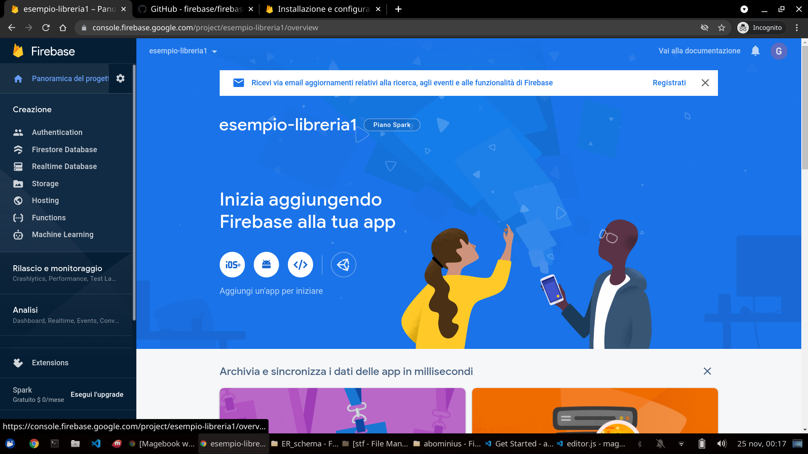

# Magebook

Magebook is a *gamebook* editor. *Gamebooks* are books where text is splitted in numbered chapters. Each chapter ends with links to other chapters. Readers should not read from the first to the latter chapter, but jump through the links as they wish.  
Here is an example with three chapters:

```markdown
# Book title
author: Name Surname

### 1
Where do you want to go? [Right 2](#2) or [left 3](#3)?

### 2
You have turned right.

### 3
You have turned left.
```
Magebook will help you write your *gamebook* with a set of specific features. Magebook files may be converted into Word/OpenOffice files, but also be used to generate [ebooks](#export-as-ebook-epub-azw3) or [Android/Ios apps](#generate-an-app-from-your-book). Moreover, with the [collaborative mode](#collaborative-projects), you may edit book with other users at the same time.


# Download
Magebook is a [web app](https://librogamesland.github.io/magebook/editor/) - you don't have to download it, just open <https://librogamesland.github.io/magebook/editor>:

<a class="button" target="_blank" href="https://librogamesland.github.io/magebook/editor">Apri Magebook</a>


Magebook works with Chrome, Firefox, Safari and Edge, other than Android and Ios smartphones.  
Offline mode is supported too - you do not need an internet connection again after opening the web page for the first time.

# Features



The top navbar `[1]` allows to load save and create new files, or to export the book into a Word/LibreOffice/OpenOffice/HTML file. The "Book" menu lets you see the book's graph and to shuffle chapters.

Below the navbar, you should see the current chapter name/number and five buttons `[2]`, useful to:
- find words
- undo/redo edits
- insert an empty link (Ctrl+L) or a link to the first avaible chapter (Ctrl+K).

The sidemenu `[3]` allows to add/edit/delete chapters and move between them. Below `[4]` you may check the list of chapters linking to the current one.

# Book format

Magebook's books are written in Markdown format. 
- new chapters starts with three hashes and a number `### number`. It's recommended to use numbers to label chapters, but you may use words too, like `### Rules`
- chapters may also have a title different from the number `### Chapter with a really long title {#number}`
- to inserta a link to a chapter, type `[number]` or, `[Text of the link](#number)`. Working links will be highlighted in blue, while orphan links are highlighted in red.


- you may also add `**bold**`, `*italic*`, `<b>bold</b>`, `<i>italic</i>`, `<u>underline</u>` text
- add comments (will not be inserted in exported files) with <code>&#96;comment&#96;</code>, for example <code>&#96;TODO: I need to revision this chapter&#96;</code>
- each chapter belongs to a group when it's labelled with `[group]:<> ("Group name")`. The right sidemenu allows to filter chapters by group. Moreover, you may choose to shuffle just a group instead of the entire book.
- `![][flag-death]`, `![][flag-final]`, `![][flag-fixed]` allows to add a flag to a chapter, so that they will be highlighted in the right sidemenu. 


Books may also have some metadata at the beginning of the document:
- a title, inserted with `# Title`
- a list of [properties](#properties), declared as `property: value`. For example, if you want to disable the short link format (i.e. `[number]`), you have to add `disableShortLinks: true`


Here is a complete example:
```markdown
# Book title
author: Name Surname
disableShortLinks: false


### 1
This is the first chapter.


### Regole
Per creare un link si usa il formato [Testo del link](#paragrafo). Se il testo è assente, Magebook lo inserirà in automatico. Ad esempio [](#Regole) equivale a [Regole](#Regole). Si possono generare anche nomi più brevi per i paragrafi, ad esempio:

### Paragrafo con titolo molto lungo {#3}
In questo caso, scrivere [](#3) equivale a [Paragrafo con titolo molto lungo](#3).

Usando gli asterischi si può inserire anche *testo in corsivo* e doppi asterischi per **testo in grassetto**.
```


# Properties

**Common:** 
- `disableShortLinks: true` disable the `[number]` link format, use just `(Text)[#number]`

**Word/OpenOffice/LibreOffice export:**  

***WORK IN PROGRESS - WILL BE AVAIABLE SOON***
- `exportPage: `
- `exportTextFont: `


**Manipolazione nomi di link e paragrafi:**  


***WORK IN PROGRESS - WILL BE AVAIABLE SOON***


# Collaborative projects

You may use Magebook to work on collaborative projects. Those projects may be edited by multiple users, with real time synced changes. To a questa funzionalità è possibile collegare a Magebook il proprio account Google attraverso Google Firebase, che è gratuito fino a 1GB di memoria (circa 500 librogame completi).

## Link your Google account to Magebook

The procedure may take some minutes, but once done, it won't be required again for later books.

Go to <https://console.firebase.google.com/>, login with Google and create a new project. Choose the name you want (its the same). You do not need to enable Google Analytics.


Once created a project, looks for "Realtime Database" in the left sidemenu. Click on "Create Database". Choose a city in the nearby and "Start in block mode".


In the next page, click on "Rules". Replace the rules with:
```javascript
{
  "rules": {
    "$secret": {
      ".read": true,
      ".write": true 
    }
  }
}
```

Almost done. Now, from the left sidemenu, click on  "Project overview".




Below the "Start by adding Firebase to your app" there is a `</>` button (web). Click it. Choose the nickname you wish (it's irrelevant) and click on "Register app".


At this point, you should see a set of auth codes, including `apiKey` and `databaseURL`. Those values should be copied and pasted Magebook. Nell'esempio della figura qui sotto i due valori sono rispettivamente `KazbNyCUNqM661l1eVQ7mqOPAIadWq1YJ7MH3Y` e `https://esempio-libreria1-default-rtdb.europe-west1.firebasedatabase.app`


Open Magebook, in the top navbar choose `File -> New Collaborative`. Insert the `apiKey` and `databaseURL` retrieved before and choose a name for your book. The name must be unique: it will identify your book forever.

Once done, it is strongly advise to save the page URL as a bookmark, to find it in the future and share to other users.

Done!


# Other formats

Oltre ai formati presenti nel menù `Esporta`, esistono numerosi altri strumenti  


### Esporta in PDF
Il metodo più veloce è esportare il file come Word/LibreOffice. A questo punto è possibile aprire il file con Word o LibreOffice e usare la funzione `Salva con nome`, selezionando il formato PDF.

### Esporta come ebook (.epub, .azw3)
I file HTML esportati da Magebook possono essere convertiti così come sono usando il programma [Calibre](https://calibre-ebook.com/download), scaricabile gratuitamente da <https://calibre-ebook.com/download>.

Da Magebook, seleziona `Esporta -> Sito web (.html)`, quindi apri Calibre. Da Calibre seleziona `Aggiungi libro` e poi `Converti libro`. Sarà possibile scegliere il formato dal menù a tendina in alto a destra. I lettori Kindle sono compatibile con i formati `.azw3` e `.mobi`, mentre per gli altri lettori è necessario scegliere `.epub`.

ATTENZIONE! Calibre riconosce in automatico il sommario esportato da Magebook, ma in alcune versioni si limita ai primi 50 paragrafi. Per cambiare questa opzione, durante l'esportazione seleziona *"Tabella dei contenuti"*.


### Generate an app from your book

***WORK IN PROGRESS - FUNZIONE PREVISTA PER IL FUTURO***

Books written with Magebook may be used to generate [hybrid apps](https://ionic.io/), which may be distributed as web apps or Android/Ios apps.

# Versioni
#### 1.0
First release.

#### 1.1
Added short link format `[number]` and property `disableShortLinks: true`.

Links to broken chapters are highlighted in the right menu.

GUI restyle.

Export as website.

Fixes.


# Licenza e autori
Magebook it's a free and open-source (MIT licensed) software, developed by **Luca Fabbian** <luca.fabbian.1999@gmail.com>, with the support of the [Librogame's Land](http://librogame.net) community.

The project started as a web version of [LibroGameCreator 3](http://www.matteoporopat.com/librogame/libro-game-creator-3/).